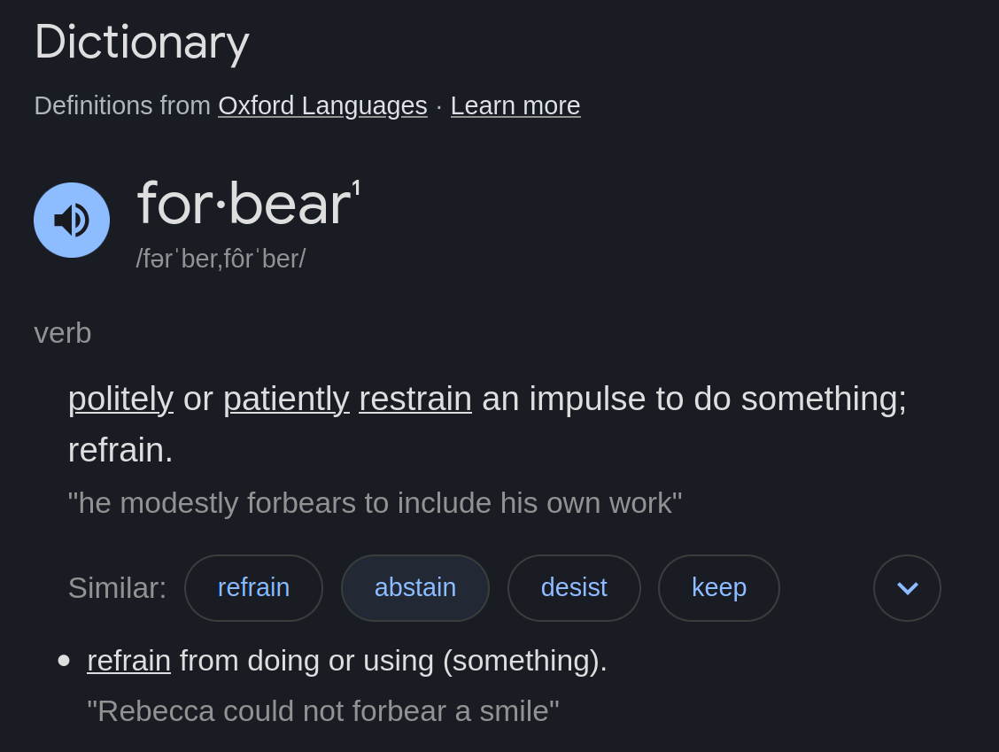

# forbear

https://github.com/user-attachments/assets/166ccfc5-71d4-4ded-a9ed-c6db7f7c2631

A GUI application framework with the purpose of creating apps that are as beautiful as the app, as performant as game engines, and with the DX of the web. 

> [!WARNING]
> actively built since ~2025, everything will
> change, proceed at your own caution.

## At a glance

```zig
const forbear = @import("forbear");

fn App() void {
  const count = forbear.useState(u32, 0);

  // forbear uses is immediate-mode GUI framework. Each frame, your code
  // describes the UI tree using function calls and re-renders everything, 
  // doing layouting again as well
  forbear.element(.{ .width = .grow, .direction = .topToBottom })({
    forbear.printText("Count: {d}", .{count.value.*});
    
    forbear.element(.{ 
      .background = .{ .color = .{ 0.0, 0.0, 0.0, 1.0 } },
      .borderRadius = 8.0,
    })({
      if (forbear.on(.click)) {
        count.value.* += 1;
      }

      forbear.text("Increment");
    });
  });
}
```

Layout is flexbox-inspired: elements either **grow** to fill available space or **fit** to their content. You compose layouts by nesting elements with alignment and padding. Layouting is heavily inspired by [Clay](https://github.com/nicbarker/clay).

State is managed through hooks (`useState`, `useEvent`) that persist across frames, similar to React hooks.

This doesn't include the current setup code you have to write, which I plan on improving with time as I find better APIs that still allow for the flexibility I want, but is currently mostly garbage.

## Why does this exist?

Right now, the most picked option for new dekstop apps are basically Electron. And there has been a growing negative sentiment, from myself as well, towards Electron. Electron was great, anyone that says oterwise is lying to themselves, but it feels like it's time for a change. Apps easily use loads of RAM, take lots of CPU, and even though it is possible to get performance to an acceptable point, I don't think it's possible to get it to feel amazing.

Something better, that serves as a better foundation is the way for us all to have apps great apps all around. I don't think we can really rely on the overall industry doing this, because it just doesn't pay off enough, even though it does an amount. If it did, we would already have a better option.

So everything culminates into this project.

## What it does today

Most of everything is still incomplete, needs a lot of work, and looks ugly. That being said, right now we alreayd have:
- Basic windowing from scratch
- Rendering pipeline with text, border radius, shadows, proper z-ordering, and other stuff
- A flexbox-inspired layout system with grow/fit, alignment, padding heavily inspired by [Clay](https://github.com/nicbarker/clay)
- A good starting point for element creation that I don't think is going to change much
- A very archaic event system that doesn't support much of everything at this point
- Some starting points for animation through `useAnimation`, `useTransition` and `useSpringTransition`

## What still needs work

Being honest about where things stand:

- Scrolling on a per element basis
- Images cause stutters
- The setup work being so cumbersome
- No component children yet
- The MacOS windowing code is completely vibe coded and with lots holes
- Support for SVGs
- Support for gradients
- Plans on accessibility like screen readers and keyboard navigation

See [TODO.md](./TODO.md) for most of everything, and [open questions](./notes/open-questions.md) for design decisions I'm still thinking through.

## Roadmap

1. Build 10 real-world UIs
  - https://uhoh.com: In progress
  - https://wayland-book.com: Planned
2. Build real applications with it
3. Multi-language bindings
  - JSX specially, so it can actually be a good subsitute for how I'd use Electron

This is a multi-year project, so I'm planning might change and that's actually very likely, so I don't want to tie myselfs to the priorities of today.

## How is this different from...?

[Clay](https://github.com/nicbarker/clay): Clay does layouting work, forbear wants to do more. forbear is meant to be a full application framework, it will handle windowing, input, text rendering, images, and more.

[Dear ImGui](https://github.com/ocornut/imgui): Meant mostly for debug tools and in-game UIs, not full fledged apps like Slack. Creating custom UI is hard, but possible. I want for it to be as easy with forbear as it is in the web.

[Iced](https://github.com/iced-rs/iced/tree/master): Struct-based and is retained mode UI, I much prefer to write UI using in a more functional approach, and I believe immediate mode scales much better.

[Slint](https://github.com/slint-ui/slint/tree/master): Custom bespoke language, also more of retained-mode.

[Flutter](https://github.com/flutter/flutter): Also uses a bespoke language, Dart. I do not want to learn Dart, and in an ideal world I want to pick any language and still have everything work basically the same with the least amount of downsides.

[Tauri](https://github.com/tauri-apps/tauri): It's the closest one to something I'd use, but unfortunately, webviews are not very good. The one on Linux, for example, catches on fire if you have anything serious going on-screen.

## No license (yet)

Building forbear has taken over a year of my life at this point where I've been turning down other ideas to focus on it. I haven't decided on the final licensing model yet. The most likely direction is **free for individuals, paid for companies** — similar to how some creative tools are licensed, exactly because it has been so hard on me to build.

For now, the code is source-available. If this concerns you or blocks you from contributing, I understand — I'm actively thinking through this and welcome the conversation. Open an issue or reach out through anywhere.

## Contributing

forbear is early and the API will certainly change. That said, if you're interested in GUI frameworks, Vulkan rendering, or Zig — I'd love to talk. The [open questions](./notes/open-questions.md) document is a good starting point to understand the design decisions being made, and the [TODOs](./TODO.md) also have some problems I'm thikning about.

---



